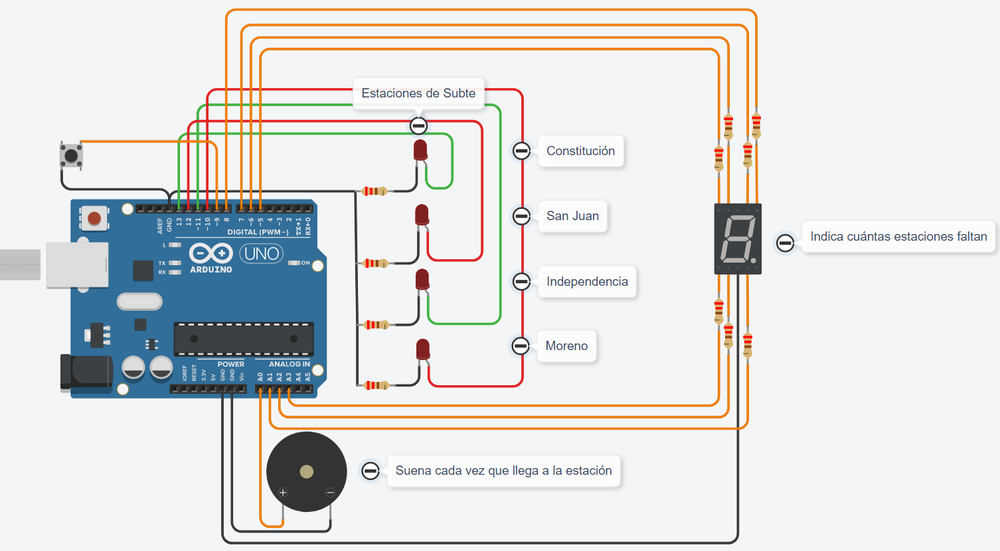

# Proyecto grupos SPD

- Nombre: Brandon Flores
- Materia: SPD
- Profesores: Esteban Quiroz y Gianni Maggiori

## Integrantes

- Corimayo Alan
- Falanga Alejandro
- Fleitas Ezequiel
- Yapura Franco

---
## Proyecto: Estación de subte



---
### Descripción
Este proyecto simula una estación de subte, a medida que van pasando las estaciones, se van encendiendo los leds, junto con estos, en el display se muestra el número de estación en el momento. Y la vez que todo esto funciona, el buzzer va sonando en cada estación.

---
## Función principal
Primero, apretamos el botón, para que así arranque todo el circuito:

- Empieza en la estación Constitución, enciende el led verde. En el display se muestra el número de la estación, 1. Y a su vez, suena el buzzer durante 500 segundos.

- Sigue con la estación San Juan, enciende el led amarillo. En el display se muestra el número de la estación, 2. Y suena el buzzer durante 500 segundos.

- Luego la estación Independencia, enciende el led azul. En el display se muestra el número de la estación, 3. Y suena el buzzer durante 500 segundos.

- Por último la estación Moreno, enciende el led rojo. En el display se muestra el número de la estación, 4. Y el buzzer suena durante 500 segundos.

Luego de esta secuencia, se vuelve a repetir en reversa, o sea que hace un camino de ida y vuelta:

    Constitución - San Juan - Independencia - Moreno - Independencia - San Juan - Constitución - etc.

---
## Porcion del codigo
```c++
void Semaforo()
{
  void loop()
  {
  if(digitalRead(Boton) == LOW)
  {
      while(digitalRead(Boton) != LOW)
      {
      PrendeYApaga(Led_C,0,1,1,0,0,0,0);
      PrendeYApaga(Led_S,1,1,0,1,1,0,1);
      PrendeYApaga(Led_I,1,1,1,1,0,0,1);
      PrendeYApaga(Led_M,0,1,1,0,0,1,1);
      PrendeYApaga(Led_I,1,1,1,1,0,0,1);
      PrendeYApaga(Led_S,1,1,0,1,1,0,1);
      }
  }

  }  
  void PrendeYApaga(int Led,int a,int b,int c,int d,int e,int f,int g)
  {
  digitalWrite(Led,HIGH);
  digitalWrite(A,a);
  digitalWrite(B,b);
  digitalWrite(C,c);
  digitalWrite(D,d);
  digitalWrite(E,e);
  digitalWrite(F,f);
  digitalWrite(G,g);
  tone(Buzzer,500,500);
  delay(5000);
  digitalWrite(Led,LOW);
  digitalWrite(A,0);
  digitalWrite(B,0);
  digitalWrite(C,0);
  digitalWrite(D,0);
  digitalWrite(E,0);
  digitalWrite(F,0);
  digitalWrite(G,0);
  delay(5000);
  }
}
```

---
## Link al proyecto

[tinkercard.com](https://www.tinkercad.com/things/jeWckQLTAcH)