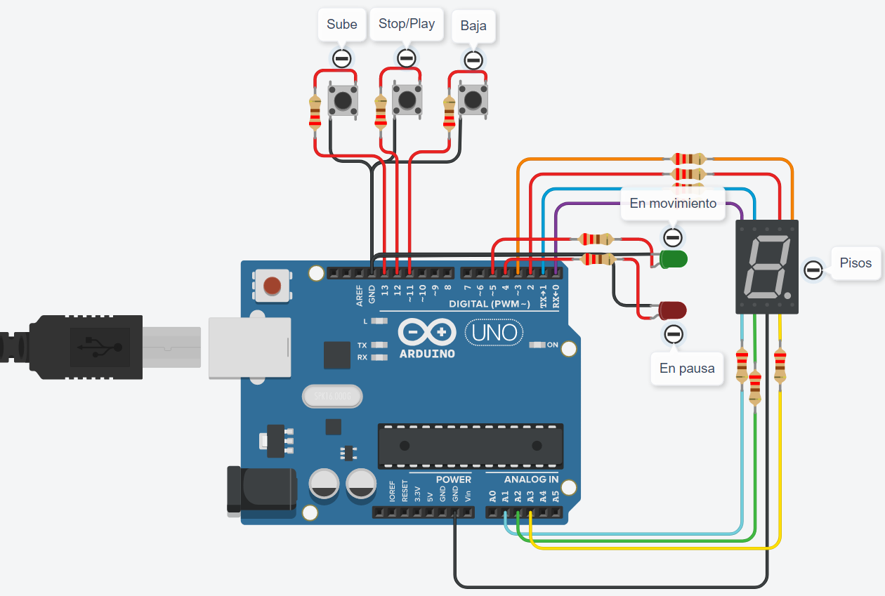

# Primer parcial SPD

- Nombre: Brandon Flores
- Materia: SPD
- Profesores: Esteban Quiroz y Gianni Maggiori

---
## Parte Práctica Domiciliaria



---
### Descripción
Lo que simula este circuito es un montacarga, a medida que va subiendo de piso, se muestra en el display en cuál se ecuentra. Los leds verde y rojo indican si el montacarga está en movimiento o en pausa. Y con los botones controlamos si este sube, baja, o se queda parado en alguno de los pisos.

---
## Función principal
- Al apretar el botón "Sube", empieza el circuito subiendo piso a piso, va desde el piso número 0, hasta el piso número 9 (a lo que llega el display).

- Para parar en alguno de los pisos, tenemos el botón "Stop/Play". En cualquier piso que querramos frenar, lo apretamos y ahí se queda, hasta que nosotros le indiquemos que continúe.

- Y por último, para bajar, el botón "Baja". Cuando lo apretemos, el montacarga empezará a bajar, ya sea que  esté en el último piso, o esté en pausa en alguno.

- Display: En el display 7 segmentos se irá mostrando en qué piso se encuentra el circuito.

- En movimiento: Cuando el circuito esté en movimiento, se encenderá el led verde.

- En pausa: Cuando el circuito se encuentre frenado, se encenderá el led rojo.

---
## Código
```c++
// C++ code

//En esta parte definimos cada Pin
#define BotonSube 13
#define BotonStopPlay 12
#define BotonBaja 11
#define A 2
#define B 3
#define C A3
#define D A2
#define E A1
#define F 1
#define G 0
#define LedVerde 5
#define LedRojo 4
int Contador;

void setup()
{
  pinMode(BotonSube, INPUT_PULLUP);
  pinMode(BotonStopPlay, INPUT_PULLUP);
  pinMode(BotonBaja, INPUT_PULLUP);
  pinMode(A, OUTPUT);
  pinMode(B, OUTPUT);
  pinMode(C, OUTPUT);
  pinMode(D, OUTPUT);
  pinMode(E, OUTPUT);
  pinMode(F, OUTPUT);
  pinMode(G, OUTPUT);
  pinMode(LedVerde, OUTPUT);
  pinMode(LedRojo, OUTPUT);
  Contador = 0;
  //Serial.begin(9600);
}

void loop()
{
  if(digitalRead(BotonSube) == LOW)
  {
    //Serial.print("Montacargas subiendo. En el piso: ");
    //Serial.println(Contador);
    for(int i = 0; i < 10; i++)
    {
      Contador++;
      LedEnMovimiento();
      SubeParaBajaPisos();
      if(digitalRead(BotonStopPlay) == LOW)
      {
        //Serial.print("Montacargas detenido. En el piso: ");
        //Serial.println(Contador);
        LedEnPausa();
        break;
      }
    }
  }
  if(digitalRead(BotonBaja) == LOW)
  {
    //Serial.print("Montacargas bajando. En el piso: ");
    //Serial.println(Contador);
    for(int i = 10; i > 0; i--)
    {
      Contador--;
      LedEnMovimiento();
      SubeParaBajaPisos();
      if(digitalRead(BotonStopPlay) == LOW)
      {
        //Serial.print("Montacargas detenido. En el piso: ");
        //Serial.println(Contador);
        LedEnPausa();
        break;
      }
    }
  }
}

void SubeParaBajaPisos()
{
  switch(Contador)
  {
    case 1:
      PisosYLed(1,1,1,1,1,1,0);//0
      break;
    case 2:
      PisosYLed(0,1,1,0,0,0,0);//1
      break;
    case 3:
      PisosYLed(1,1,0,1,1,0,1);//2
      break;
    case 4:
      PisosYLed(1,1,1,1,0,0,1);//3
      break;
    case 5:
      PisosYLed(0,1,1,0,0,1,1);//4
      break;
    case 6:
      PisosYLed(1,0,1,1,0,1,1);//5
      break;
    case 7:
      PisosYLed(1,0,1,1,1,1,1);//6
      break;
    case 8:
      PisosYLed(1,1,1,0,0,0,0);//7
      break;
    case 9:
      PisosYLed(1,1,1,1,1,1,1);//8
      break;
    case 10:
      PisosYLed(1,1,1,1,0,1,1);//9
      break;
  }
}

void LedEnMovimiento()
{
  digitalWrite(LedVerde,HIGH);
  digitalWrite(LedRojo,LOW);
}

void LedEnPausa()
{
  digitalWrite(LedRojo,HIGH);
  digitalWrite(LedVerde,LOW);
}

void PisosYLed(int a,int b,int c,int d,int e,int f,int g)
{
  digitalWrite(A,a);
  digitalWrite(B,b);
  digitalWrite(C,c);
  digitalWrite(D,d);
  digitalWrite(E,e);
  digitalWrite(F,f);
  digitalWrite(G,g);
  delay(1000);
}
```

---
## Link al proyecto

[tinkercard.com](https://www.tinkercad.com/things/hdnTTYVUAlF)